# UML Class Diagram

## Project Overview
**Spynet** is a web application designed to analyze and map the technologies used by websites. It analyzes the technological structure of a website (including frontend, backend, services), domain information (WHOIS), DNS data, and historical snapshots. It follows a modular architecture built with Python, Django, DRF, and decoupled services for each type of analysis, allowing users to inspect, compare, and understand the technical composition of different web pages in a structured way.

## Scope
The analysis covers the main core analysis files of the repository, excluding unnecessary files or folders such as tests, virtual environments (`.venv`), `__pycache__`, `.git`, documentation assets (`img/`), `Workshop-1/`, and other configuration or non-code files.

The following Python packages and modules were analyzed:
* **Root package:** `analyzer.py`
* **Core package (`core/`):** `js_fetcher.py`, `signature_loader.py`
* **Detectors package (`detectors/`):** `base_detector.py`, `backend_detector.py`, `frontend_detector.py`, `cdn_detector.py`, `detector_factory.py`
* **Services package (`services/`):** `base_services.py`, `dns_service.py`, `geo_service.py`, `wayback_service.py`, `whois_service.py`

## PlantUML Class Diagram

```plantuml
@startuml
skinparam classAttributeIconSize 0

package "spynet (root)" {
    class Analyzer {
        + TIMEOUT: int
        + DEFAULT_HEADERS: dict
        - _factory: DetectorFactory
        - _dns: DnsRecordService
        - _geo: GeoService
        - _whois: WhoisService
        - _wayback: WaybackService
        - _probe_paths: list[str]
        + __init__()
        + analyze(url: str, depth_data: bool): dict
        + analyze_snapshot(snapshot_url: str): dict | None
        - _run_detectors(page: dict, base_url: str, ns_list: list, server_ip: str): list[dict]
        - _probe_paths_request(base_url: str): dict
        - _extract_resources(html: str, base_url: str): list[str]
        - _collect_probe_paths(): list[str]
        - _normalize_url(url: str): str
        - _fetch_page(url: str): dict | None
        - _extract_scripts(html: str): list[str]
    }
}

package "core" {
    class SignatureLoader {
        - _instance: SignatureLoader
        - _signatures: dict
        + __new__(cls)
        - _load()
        + get(category: str): dict
        + get_all(): dict
    }

    class js_fetcher << (M, #FF7700) module >> {
        + MAX_JS_SIZE: int
        + MAX_JS_FILES: int
        + TIMEOUT: int
        + DEFAULT_HEADERS: dict
        + PRIORITY_KEYWORDS: list
        + SKIP_KEYWORDS: list
        + fetch_js_contents(base_url: str, script_srcs: list[str]): list[str]
        - _prioritize(srcs: list[str]): list[str]
        - _is_same_origin_hint(url: str): bool
        - _download(src: str, base_url: str): str | None
    }
}

package "detectors" {
    abstract class BaseDetector {
        + signatures: dict
        + __init__(signatures: dict)
        + {abstract} detect(html: str, headers: dict, scripts: list[str], cookies: dict, js_contents: list[str], resources: list[str], probe_responses: dict): list[dict]
        - _match_header(pattern: str, headers_lower: dict): bool
        - _score_to_confidence(score: int): int
        - _build_result(name: str, category: str, score: int, evidence: list[str]): dict
    }

    class BackendDetector {
        + detect(html: str, headers: dict, scripts: list[str], cookies: dict, js_contents: list[str], resources: list[str], probe_responses: dict): list[dict]
    }

    class FrontendDetector {
        + detect(html: str, headers: dict, scripts: list[str], cookies: dict, js_contents: list[str], resources: list[str], probe_responses: dict): list[dict]
    }

    class CDNDetector {
        + detect(html: str, headers: dict, scripts: list[str], nameservers: list[str], server_ip: str): list[dict]
    }

    class DetectorFactory {
        - _registry: dict
        - _loader: SignatureLoader
        + __init__()
        + create(category: str): BaseDetector
        + create_all(): dict[str, BaseDetector]
        + {static} register(category: str, detector_class: type)
    }
}

package "services" {
    abstract class BaseServices {
        + {abstract} fetch_service(url: str, depth_data: bool)
    }

    class DnsRecordService {
        + fetch_service(url, depth_data)
        + get_dns_records(url: str): dict
    }

    class GeoService {
        + api_endpoint: str
        + __init__()
        + fetch_service(url, depth_data)
        + get_geoinfo(url, all_data: bool): dict
    }

    class WaybackService {
        + cdx_api: str
        + headers: dict
        + __init__()
        + fetch_service(url, depth_data)
        + get_count(domain: str): int
        + get_snapshots(domain: str): list
        + get_wayback(url: str): dict
    }

    class WhoisService {
        + fetch_service(url, depth_data)
        + get_whois(url: str, all_data: bool): dict
    }
}

' Herencia
BaseDetector <|-- BackendDetector
BaseDetector <|-- FrontendDetector
BaseDetector <|-- CDNDetector

BaseServices <|-- DnsRecordService
BaseServices <|-- GeoService
BaseServices <|-- WaybackService
BaseServices <|-- WhoisService

' Composiciones y Asociaciones de Analyzer
Analyzer *-- DetectorFactory
Analyzer *-- DnsRecordService
Analyzer *-- GeoService
Analyzer *-- WhoisService
Analyzer *-- WaybackService

' Dependencias de Analyzer
Analyzer ..> SignatureLoader : usa
Analyzer ..> js_fetcher : usa

' Composiciones y Dependencias de Detectors
DetectorFactory *-- SignatureLoader
DetectorFactory ..> FrontendDetector : crea
DetectorFactory ..> BackendDetector : crea
DetectorFactory ..> CDNDetector : crea
@enduml
```

