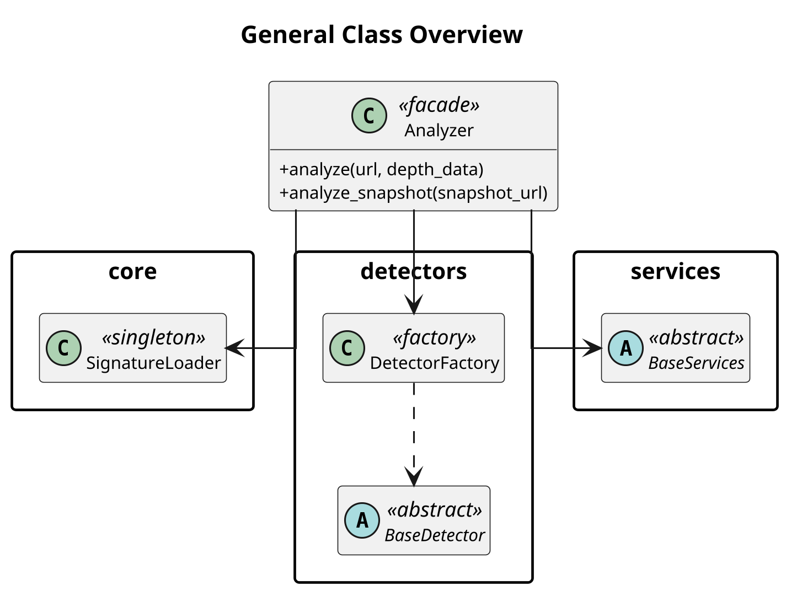
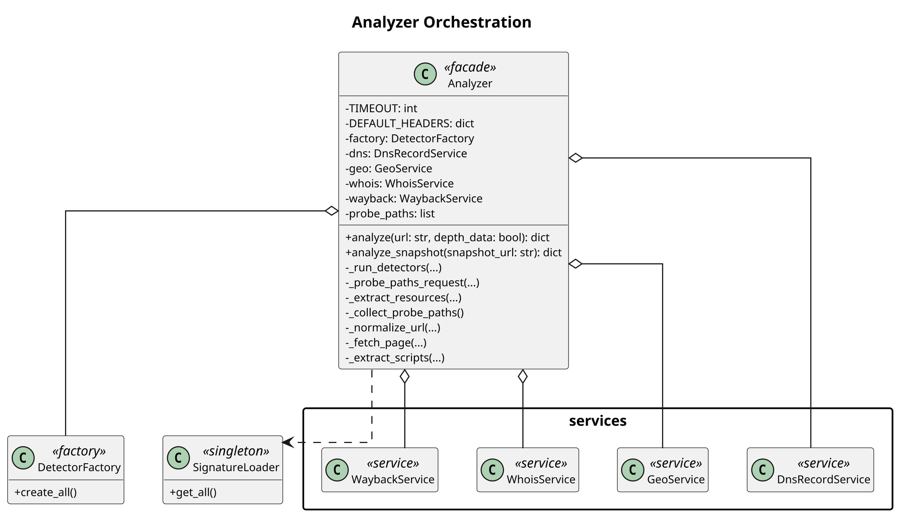
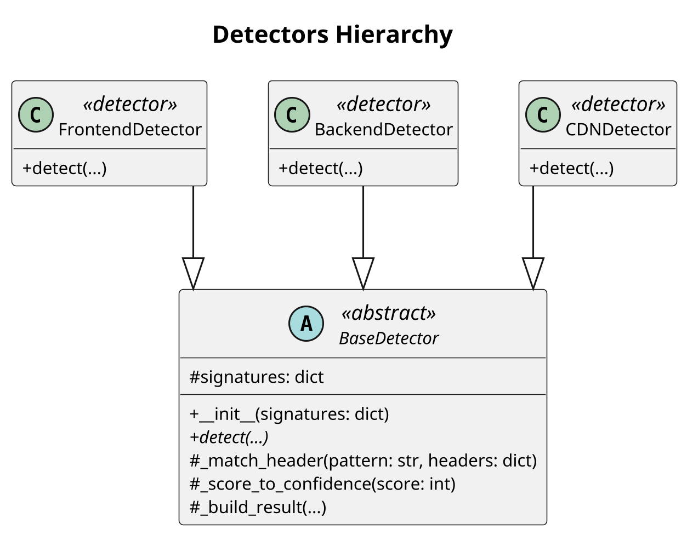
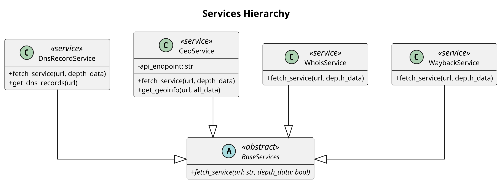
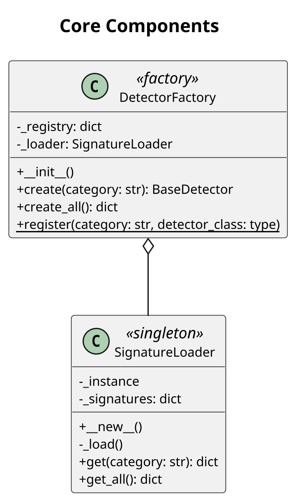
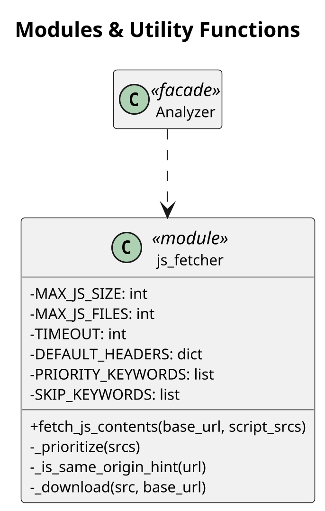
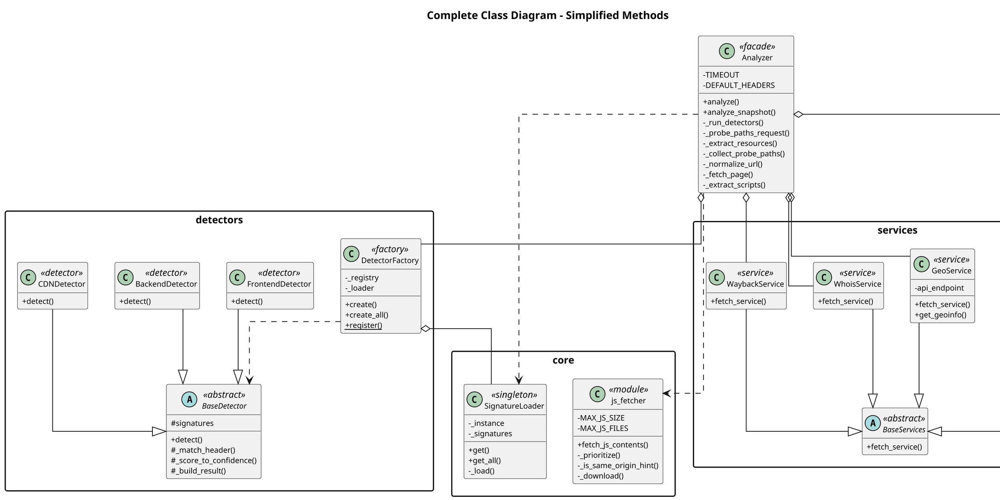

# UML Class Diagrams

## Purpose
El diagrama de clases original era demasiado grande para insertarse en un documento vertical estándar. Este archivo divide la arquitectura completa en varias vistas más pequeñas y manejables, manteniendo toda la jerarquía, relaciones y componentes principales del proyecto, sin perder información crítica.

## Render Instructions
Cada bloque de código contenido en este documento está escrito en formato PlantUML. Para visualizarlos:
1. Copia el bloque completo (desde `@startuml` hasta `@enduml`).
2. Pégalo en un archivo con extensión `.puml` en Visual Studio Code.
3. Renderízalo usando la extensión **PlantUML**.

## Recommended Order for Google Docs
Para incluir estos diagramas en tu documento vertical de manera lógica, se recomienda este orden:
1. General Class Overview
2. Analyzer Orchestration
3. Detectors Hierarchy
4. Services Hierarchy
5. Core Components
6. Modules / Utility Functions
7. Complete Class Diagram - Simplified Methods

---

## 1. General Class Overview

## 2. Analyzer Orchestration

## 3. Detectors Hierarchy

## 4. Services Hierarchy

## 5. Core Components

## 6. Modules / Utility Functions

## 7. Complete Class Diagram - Simplified Methods

## 8. Coverage Matrix

| Clase / Módulo | Diagrama donde aparece | Rol | Relaciones principales |
| --- | --- | --- | --- |
| `Analyzer` | General Class Overview, Analyzer Orchestration, Modules | Orquestador / Facade principal | `DetectorFactory`, `BaseServices`, `js_fetcher` |
| `DetectorFactory` | General Class Overview, Analyzer Orchestration, Core Components | Factory para instanciar detectores | `BaseDetector`, `SignatureLoader` |
| `BaseDetector` | General Class Overview, Detectors Hierarchy | Interfaz base para detectores | `FrontendDetector`, `BackendDetector`, `CDNDetector` |
| `FrontendDetector` | Detectors Hierarchy | Detector de tecnologías Frontend | Hereda de `BaseDetector` |
| `BackendDetector` | Detectors Hierarchy | Detector de tecnologías Backend | Hereda de `BaseDetector` |
| `CDNDetector` | Detectors Hierarchy | Detector de infraestructura y CDN | Hereda de `BaseDetector` |
| `BaseServices` | General Class Overview, Services Hierarchy | Interfaz base para servicios | `DnsRecordService`, `GeoService`, `WhoisService`, `WaybackService` |
| `DnsRecordService` | Analyzer Orchestration, Services Hierarchy | Servicio para consultas DNS | Hereda de `BaseServices`, usado por `Analyzer` |
| `GeoService` | Analyzer Orchestration, Services Hierarchy | Servicio para geolocalización | Hereda de `BaseServices`, usado por `Analyzer` |
| `WhoisService` | Analyzer Orchestration, Services Hierarchy | Servicio para obtener información WHOIS | Hereda de `BaseServices`, usado por `Analyzer` |
| `WaybackService` | Analyzer Orchestration, Services Hierarchy | Servicio de consulta a Wayback Machine | Hereda de `BaseServices`, usado por `Analyzer` |
| `SignatureLoader` | General Class Overview, Analyzer Orchestration, Core Components | Singleton que carga `signatures.json` | `DetectorFactory`, `Analyzer` |
| `js_fetcher` | Modules / Utility Functions | Funciones para descarga de archivos JS | Usado por `Analyzer` |

## 9. Notes for Presentation
Durante una exposición o revisión técnica, puedes usar estos puntos para explicar y defender el diseño de los diagramas:

*   **General Class Overview:** Muestra la visión a "vuelo de pájaro" de todo el proyecto. Presenta los tres grandes paquetes (core, detectors, services) interactuando con el orquestador principal (`Analyzer`). Sirve como introducción.
*   **Analyzer Orchestration:** Explica cómo la clase principal inicializa y administra todos sus recursos. Destaca la composición y agregación que tiene `Analyzer` con todos los servicios particulares y el `DetectorFactory`.
*   **Detectors Hierarchy:** Demuestra el uso claro del Patrón Strategy / Polimorfismo. Todos los detectores implementan la misma base abstracta `BaseDetector`, lo que permite que el `DetectorFactory` y el `Analyzer` los manipulen de forma estandarizada e independiente de su tipo.
*   **Services Hierarchy:** Al igual que en detectores, evidencia el uso de polimorfismo. Todos los servicios garantizan la existencia del método `fetch_service()`.
*   **Core Components:** Destaca la aplicación del patrón Singleton en `SignatureLoader` para optimizar la carga de reglas y cómo se vincula íntimamente con `DetectorFactory`.
*   **Diseño Modular:** Dividir los diagramas ha permitido demostrar que el software sigue principios SOLID. Las interfaces están separadas, y la división en diferentes vistas previene la saturación cognitiva para los lectores. Todo fluye de manera lógica de arriba a abajo, lo que es óptimo para los formatos de documentos verticales.
