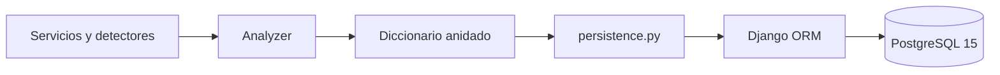
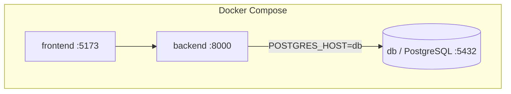
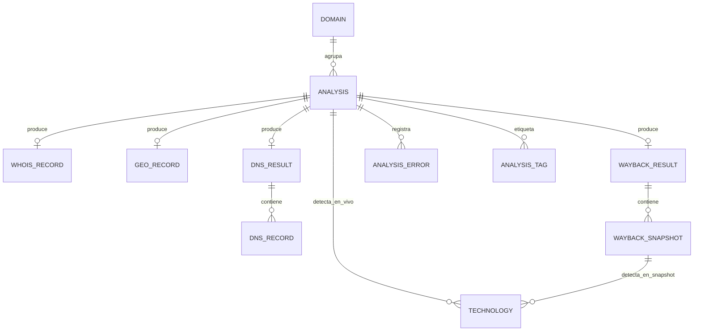
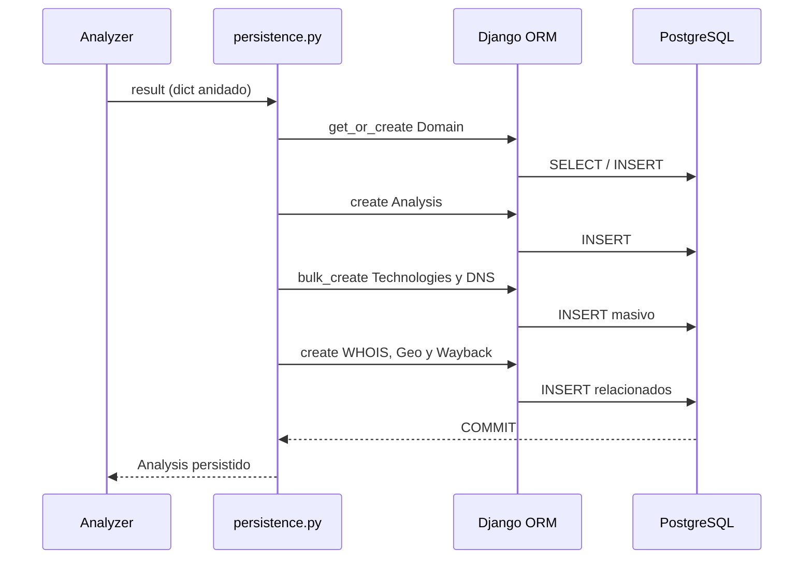

# SpyNet — Guía técnica de base de datos, Django ORM y PostgreSQL

> Recurso de sustentación y referencia técnica del modelo de persistencia de SpyNet.
>
> **Alcance:** conexión con PostgreSQL, modelos Django, relaciones, normalización,
> restricciones, transacciones, migraciones y flujo de persistencia.

---

## 1. Idea central

SpyNet recibe información heterogénea de distintos servicios —tecnologías, DNS,
WHOIS, geolocalización, TLS, seguridad y Wayback Machine— y debe conservarla con
integridad para consultarla, compararla y reconstruirla posteriormente.

La solución se divide en tres piezas:

1. **PostgreSQL** almacena los datos de forma persistente y aplica restricciones.
2. **Django ORM** representa las tablas y relaciones mediante clases Python.
3. **`api/persistence.py`** transforma la respuesta anidada del analizador en filas
   normalizadas dentro de transacciones atómicas.



El ORM no reemplaza la base de datos. Es una capa de abstracción que convierte
operaciones Python como `Analysis.objects.create(...)` en SQL y luego convierte
los resultados SQL nuevamente en objetos Python.

---

## 2. ¿Por qué PostgreSQL?

PostgreSQL es adecuado para SpyNet porque proporciona:

- integridad referencial mediante claves foráneas;
- transacciones ACID;
- restricciones `CHECK`, `UNIQUE` y `NOT NULL`;
- tipos relacionales y campos JSON;
- buen desempeño para filtros, agregaciones e historial;
- compatibilidad oficial con Django;
- persistencia mediante volúmenes de Docker.

SpyNet utiliza PostgreSQL tanto en desarrollo como en el despliegue documentado.
No se depende de SQLite para el flujo normal del proyecto.

---

## 3. Conexión Django–PostgreSQL

La configuración se encuentra en `config/settings.py`:

```python
DATABASES = {
    "default": {
        "ENGINE": "django.db.backends.postgresql",
        "NAME": os.environ.get("POSTGRES_DB", "spynet-db"),
        "USER": os.environ.get("POSTGRES_USER", "admin"),
        "PASSWORD": os.environ.get("POSTGRES_PASSWORD", "admin123"),
        "HOST": os.environ.get("POSTGRES_HOST", "localhost"),
        "PORT": os.environ.get("POSTGRES_PORT", "5432"),
    }
}
```

### 3.1 Significado de cada parámetro

| Parámetro | Función |
|---|---|
| `ENGINE` | Selecciona el backend PostgreSQL de Django |
| `NAME` | Nombre de la base de datos |
| `USER` | Usuario con el que Django se autentica |
| `PASSWORD` | Contraseña obtenida del entorno |
| `HOST` | Host donde está PostgreSQL |
| `PORT` | Puerto del servidor, normalmente `5432` |

### 3.2 Diferencia entre ejecución manual y Docker Compose

- Si Django corre directamente en Windows/Linux y PostgreSQL está publicado por
  Docker, el host es `localhost`.
- Si Django corre dentro del contenedor `backend`, el host es `db`, que es el
  nombre del servicio de PostgreSQL en `docker-compose.yml`.



El servicio `backend` espera a que el `healthcheck` de PostgreSQL responda y luego
ejecuta:

```bash
python manage.py migrate && python manage.py runserver 0.0.0.0:8000
```

El volumen `postgres_data` impide que la información desaparezca al recrear el
contenedor.

---

## 4. Modelo relacional

El modelo contiene 11 entidades principales:

| Entidad | Responsabilidad |
|---|---|
| `Domain` | Identidad única del dominio y agrupación de análisis |
| `Analysis` | Ejecución concreta sobre una URL |
| `WhoisRecord` | Resultado WHOIS del análisis |
| `GeoRecord` | Geolocalización y datos de red |
| `DnsResult` | Cabecera del resultado DNS |
| `DnsRecord` | Registro DNS individual |
| `WaybackResult` | Resumen histórico asociado al análisis |
| `WaybackSnapshot` | Captura individual de Wayback |
| `Technology` | Tecnología detectada con evidencia y confianza |
| `AnalysisError` | Fallo parcial de un servicio externo |
| `AnalysisTag` | Metadato clave–valor del análisis |

### 4.1 Relaciones



En Django, una relación se implementa con:

- `ForeignKey`: muchos registros hijos pueden pertenecer a un padre;
- `OneToOneField`: un análisis puede tener como máximo un resultado de ese tipo;
- `related_name`: nombre usado para navegar la relación inversa;
- `on_delete=models.CASCADE`: al eliminar el padre, se eliminan sus dependencias.

Ejemplo:

```python
domain = models.ForeignKey(
    Domain,
    related_name="analyses",
    on_delete=models.CASCADE,
)
```

Esto permite navegar en ambas direcciones:

```python
analysis.domain             # Analysis -> Domain
domain.analyses.all()       # Domain -> todos sus Analysis
```

---

## 5. Decisiones de diseño importantes

### 5.1 Separar `Domain` de `Analysis`

Un dominio puede analizarse muchas veces. Si el nombre se copiara en cada análisis,
habría redundancia y riesgo de inconsistencias. `Domain.name` es único y
`Analysis` guarda la URL exacta, el momento y el origen de cada ejecución.

```python
domain, _ = Domain.objects.get_or_create(
    name=extract_domain(result["url"])
)
```

`get_or_create` reutiliza el dominio si ya existe y evita duplicarlo.

### 5.2 `OneToOneField` para resultados únicos

WHOIS, geolocalización, DNS y Wayback representan como máximo un bloque de
resultado por análisis. Por eso se modelan como relaciones uno a uno. Sus filas
pueden no existir si el servicio externo falla.

### 5.3 Normalización de DNS

El analizador entrega DNS como un diccionario:

```python
{"A": ["93.184.216.34"], "MX": ["10 mail.example.com"]}
```

La persistencia lo descompone en `DnsResult` y varias filas `DnsRecord`. Esto evita
guardar listas opacas y permite filtrar por tipo, valor o prioridad.

### 5.4 Dos padres posibles para `Technology`

Una tecnología puede proceder de:

- un análisis en vivo (`analysis_id`), o
- un snapshot histórico (`snapshot_id`).

Debe existir **exactamente uno** de los dos padres. El modelo lo garantiza en la
base de datos con `CheckConstraint`:

```python
models.CheckConstraint(
    name="technology_exactly_one_parent",
    condition=(
        (Q(analysis__isnull=False) & Q(snapshot__isnull=True))
        | (Q(analysis__isnull=True) & Q(snapshot__isnull=False))
    ),
)
```

Esta regla XOR impide dos estados inválidos:

| `analysis_id` | `snapshot_id` | ¿Válido? |
|---|---|---|
| valor | `NULL` | Sí, tecnología en vivo |
| `NULL` | valor | Sí, tecnología histórica |
| valor | valor | No, origen ambiguo |
| `NULL` | `NULL` | No, tecnología huérfana |

La restricción vive en PostgreSQL, por lo que protege la integridad incluso si
un dato intenta insertarse fuera del flujo normal de Django.

### 5.5 JSONField: flexibilidad controlada

`Analysis.tls`, `Analysis.security` y `Analysis.email_security` son `JSONField`
porque contienen resultados semiestructurados que pueden evolucionar. Los datos
relacionales centrales permanecen normalizados; JSON se reserva para bloques
variables que normalmente se leen como una unidad.

---

## 6. Flujo de persistencia

El punto de entrada principal es:

```python
persist_analysis(result, triggered_by="api", duration_ms=...)
```

Su ejecución puede resumirse así:



Pasos relevantes:

1. Extraer y reutilizar el dominio.
2. Determinar si el análisis fue `completed` o `partial`.
3. Crear `Analysis` con URL, duración, TLS y seguridad.
4. Guardar tecnologías asociadas al análisis.
5. Guardar WHOIS, geolocalización y DNS.
6. Guardar Wayback solo si fue solicitado.
7. Registrar fallos parciales como `AnalysisError`.
8. Confirmar toda la transacción.

Hay flujos especializados:

- `persist_snapshot`: persiste una captura individual y asigna sus tecnologías al snapshot;
- `persist_history`: crea un análisis histórico con múltiples snapshots;
- `persist_wayback`: adjunta datos Wayback a un análisis existente.

---

## 7. Atomicidad y tolerancia a fallos

Las funciones críticas usan:

```python
@transaction.atomic
```

Esto crea una frontera transaccional:

- si todas las escrituras funcionan, PostgreSQL realiza `COMMIT`;
- si ocurre una excepción, PostgreSQL realiza `ROLLBACK`;
- no queda un `Analysis` sin sus datos hijos por una escritura interrumpida.

Es importante distinguir dos tipos de fallo:

1. **Fallo esperado de un servicio:** se persiste el análisis como `partial` y se
   crea un `AnalysisError` para mantener observabilidad.
2. **Fallo inesperado de persistencia:** se revierte la transacción completa.

Esta decisión permite que SpyNet degrade de forma controlada cuando WHOIS o Geo
no responden, sin aceptar estados corruptos en la base de datos.

---

## 8. Rendimiento: `bulk_create`

Para colecciones como tecnologías, registros DNS y snapshots se utiliza
`bulk_create`. En vez de ejecutar un `INSERT` por cada elemento, Django agrupa las
filas y reduce viajes entre la aplicación y PostgreSQL.

```python
Technology.objects.bulk_create([
    Technology(...)
    for technology in technologies
])
```

La ventaja es mayor cuando un análisis histórico contiene varios snapshots y
cada snapshot incorpora múltiples tecnologías.

---

## 9. Migraciones

Las migraciones son el historial versionado del esquema. No contienen los datos;
describen cómo transformar la estructura de la base de datos.

Flujo de trabajo:

```bash
python manage.py makemigrations
python manage.py migrate
python manage.py showmigrations
```

En SpyNet:

| Migración | Cambio principal |
|---|---|
| `0001_initial` | Creación del modelo relacional inicial |
| `0002` | Ajuste de opciones para `triggered_by` |
| `0003` | Ampliación de categorías de `Technology` |
| `0004` | TLS y nuevos campos de geolocalización/WHOIS |
| `0005` | Campo JSON `security` |
| `0006` | Campo JSON `email_security` |

`makemigrations` compara los modelos con el estado registrado y genera una nueva
migración. `migrate` ejecuta el SQL necesario y registra qué migraciones quedaron
aplicadas.

---

## 10. Consultas ORM útiles para demostrar

Abrir shell:

```bash
python manage.py shell
```

Ejemplos:

```python
from api.models import Analysis, Domain, Technology

# Últimos análisis (Meta.ordering ya usa analyzed_at descendente)
Analysis.objects.all()[:5]

# Historial de un dominio
Domain.objects.get(name="example.com").analyses.all()

# Tecnologías detectadas en vivo
Technology.objects.filter(analysis__isnull=False)

# Tecnologías históricas
Technology.objects.filter(snapshot__isnull=False)

# Análisis parciales
Analysis.objects.filter(status="partial")

# Tecnologías de servidor con confianza alta
Technology.objects.filter(category="server", confidence__gte=80)

# Cargar relaciones eficientemente
Analysis.objects.select_related("domain").prefetch_related("technologies")
```

Para observar el SQL que genera el ORM:

```python
query = Technology.objects.filter(category="server", confidence__gte=80)
print(query.query)
```

---

## 11. Comandos de diagnóstico

```bash
# Estado de los contenedores
docker compose ps

# Logs de PostgreSQL
docker compose logs -f db

# Validar configuración de Django
python manage.py check

# Ver migraciones
python manage.py showmigrations

# Abrir cliente SQL dentro del contenedor
docker compose exec db psql -U admin -d spynet-db
```

Dentro de `psql`:

```sql
\dt
\d api_analysis
\d api_technology
SELECT id, source_url, status, analyzed_at FROM api_analysis ORDER BY analyzed_at DESC LIMIT 5;
```

---

## 12. Guion breve para la sustentación

> “La persistencia de SpyNet se construyó con PostgreSQL y Django ORM. Los modelos
> de `api/models.py` representan once entidades normalizadas. `Domain` agrupa los
> análisis del mismo sitio y `Analysis` representa cada ejecución. Los resultados
> únicos, como WHOIS o Geo, usan uno a uno; las colecciones, como DNS y snapshots,
> usan uno a muchos.
>
> La salida del analizador llega como un diccionario anidado. `api/persistence.py`
> la descompone en filas relacionadas y realiza las escrituras dentro de
> `transaction.atomic`, de modo que PostgreSQL confirma el conjunto completo o lo
> revierte si hay un error inesperado. Los fallos normales de servicios externos
> no destruyen el análisis: producen estado parcial y un `AnalysisError`.
>
> La decisión más importante del modelo es `Technology`. Una tecnología puede
> pertenecer a un análisis en vivo o a un snapshot histórico, pero nunca a ambos
> ni a ninguno. Esa condición XOR está protegida por un `CheckConstraint` en la
> propia base de datos. Finalmente, las migraciones mantienen el esquema
> versionado y Docker Compose garantiza una conexión reproducible con PostgreSQL
> 15 y almacenamiento persistente.”

---

## 13. Preguntas probables y respuestas

### ¿El ORM significa que no se usa SQL?

No. El ORM genera SQL a partir de operaciones Python. PostgreSQL sigue ejecutando
consultas, restricciones, transacciones y almacenamiento.

### ¿Por qué no guardar todo el resultado como un JSON?

Porque se perderían integridad referencial, consultas eficientes y relaciones
claras. SpyNet usa tablas para información estable y JSON solo para bloques
semiestructurados como TLS y auditoría.

### ¿Por qué `Domain` y `Analysis` no son la misma tabla?

Porque un dominio tiene múltiples análisis en el tiempo. Separarlos evita repetir
información del dominio y permite construir historial.

### ¿Por qué algunas relaciones uno a uno pueden no tener fila?

Los servicios externos pueden fallar. La ausencia de la fila representa que no
hubo resultado, mientras `AnalysisError` conserva la causa.

### ¿Qué protege `transaction.atomic`?

Evita escrituras parciales ante excepciones. Todas las operaciones dentro del
bloque se confirman juntas o se revierten juntas.

### ¿Para qué sirve `related_name`?

Define el nombre de la relación inversa. Por ejemplo, desde un `Domain` se accede
a sus análisis mediante `domain.analyses.all()`.

### ¿Qué hace `on_delete=models.CASCADE`?

Preserva consistencia al eliminar un padre: también elimina sus registros hijos,
evitando filas huérfanas.

### ¿Por qué usar `bulk_create`?

Reduce el número de consultas al insertar colecciones y mejora el rendimiento.

### ¿Qué diferencia hay entre `makemigrations` y `migrate`?

`makemigrations` genera archivos que describen cambios; `migrate` los aplica en
la base de datos.

### ¿Cómo se conserva la base si Docker se reinicia?

El volumen nombrado `postgres_data` almacena los archivos de PostgreSQL fuera del
ciclo de vida del contenedor.

### ¿Qué ocurre si WHOIS falla?

El análisis puede marcarse como `partial`, no se crea un `WhoisRecord` vacío y se
registra un `AnalysisError`. El resto de datos útiles se conserva.

### ¿Dónde se garantiza que `Technology` tenga un solo padre?

En `api/models.py` mediante el `CheckConstraint`
`technology_exactly_one_parent`, que Django convierte en una restricción SQL de
PostgreSQL.

---

## 14. Archivos que debes poder explicar

| Archivo | Qué debes identificar |
|---|---|
| `api/models.py` | Entidades, relaciones, restricciones y serialización `to_dict` |
| `api/persistence.py` | Conversión del resultado a filas y uso de transacciones |
| `config/settings.py` | Backend PostgreSQL y variables de conexión |
| `docker-compose.yml` | Servicios, hostname `db`, healthcheck y volumen |
| `api/migrations/` | Evolución versionada del esquema |
| `api/serializers/` | Validación y representación de solicitudes/respuestas |
| `tests/api/` | Verificación del comportamiento de endpoints y persistencia |

---

## 15. Conclusión

El diseño de datos de SpyNet no se limita a “guardar resultados”. Convierte datos
externos variables en un modelo relacional trazable, evita duplicados, preserva
el origen de cada tecnología, tolera fallos parciales y protege la consistencia
mediante restricciones y transacciones ejecutadas por PostgreSQL. Django ORM
reduce el acoplamiento con SQL manual, pero mantiene visibles y verificables las
decisiones del modelo.
